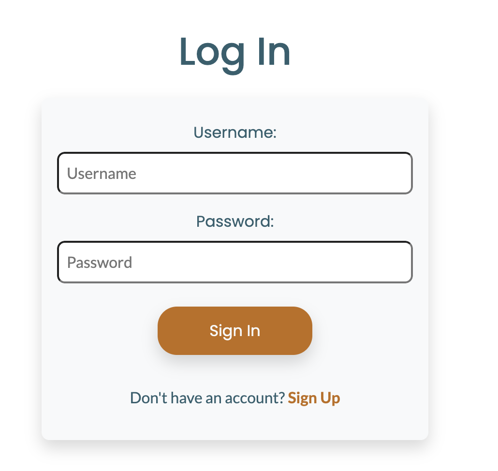

# Track My Job

An user-friendly application that helps users efficiently manage and track their job applications. Applying for jobs across multiple platforms can quickly become overwhelming, making it difficult to monitor each application's status. With Track My Job, users can easily keep track of all their job applications in one place. The app provides visual insights, such as pie charts, to display application statistics, helping users evaluate and adjust their job search strategies as needed. 
The live deployed site can be found [here](https://job-application-tracker-team5-0fc397c8056e.herokuapp.com/)

## Contents 

- [Agile Develipment](#agile-development)
- [User Experience (UX)](#user-experienceux)
  - [User Stories](#user-stories)
- [Design](#design)
  - [Colour Scheme](#colour-scheme)
  - [Wireframe](#wireframe)
  - [Typography](#typography)
  - [Features](#features)
    - [Home](#home)
    - [Job Applications](#job-applications)
    - [Dashboard](#dashboard)
    - [Contact](#contact)
    - [FAQ](#faq)
    - [Privacy Policy](#privacy-policy)
    - [Register](#register)
    - [Login](#login)
    - [Future Implementations](#future-implementations)
- [Technologies,Languages & Programs used](#technologieslanguages--programs-used)
- [Deployment & Local Development](#deployment--local-development)
  - [Local Deployment](#local-deployment)
  
## Agile Development

The project was developed using Agile principles throughout. User stories were prioritized using MoSCoW, and the Minimum Viable Product (MVP) was identified for early deployment.

## User Experience(UX)

### User Stories

User Stories were tracked throughout the project as [GitHub issues](https://github.com/users/Tamas-Gavlider/projects/4). 

## Design

### Colour Scheme

#F2EBE1 (Off-white) – Great for background elements, keeping things clean and minimal. 
#305F6D (Teal) – Ideal for headers, highlights, or icons to bring focus and contrast. 
#BF6E15 (Orange) – This strong accent color could be used for buttons, call-to-actions, or important highlights to draw attention. 
#C1884E (Light Brown) – A softer tone that would pair well with the orange, maybe for secondary buttons or text. 
#698C8E (Muted Blue) – A calming color that would work great for less prominent text, borders, or nav/ footer sections.

This palette balances warm and cool tones, making the app feel both welcoming and trustworthy

### Wireframe

Wireframes were created for mobile, tablet and desktop. 
Index page 

Registration 

Dashboard 

Profile 

Help 

### Typography

Poppins from Google Fonts was chosen to ensure the text is easy to read. Its letterforms are nearly monolinear, with optical corrections applied to stroke joints where necessary, maintaining an even typographic color.

### Features

All pages feature a fully responsive navbar that transforms into a hamburger menu on smaller screens and a [favicon](static/images/apple-touch-icon.png) in the browser tab. 
Navbar if user logged in 

Navbar if user is not registered/logged in 

#### Home

The home page features a welcome message explaining why to choose this tool, along with login and register buttons.

#### Job Applications

Accessible only to registered and logged-in users. Users can view their job applications, add new ones, or edit existing ones. If users prefer not to use the dashboard, they can easily add their job applications directly on the Job Applications page.

#### Dashboard

Accessible only to registered and logged-in users. One of the key component of the application. It not only allows users to add new job applications but also provides a visual overview of their existing ones through various charts. By comparing successful applications with unsuccessful ones, users can gain valuable insights into which roles are the best fit for them.

#### Contact

Users can fill out a contact form to provide feedback on bugs or suggest potential future features.

#### FAQ

The FAQ section addresses the most common user questions. If users don't find the answer they're looking for, they can reach out via the contact form. 

#### Privacy Policy

#### Register

New users can register for an account to access and use the application.

#### Login

Login page for existing users.

#### Future Implementations

Integrate the application with LinkedIn APIs, allowing new job applications to automatically flow into the app and appear on the dashboard. 
The application may also be suitable for corporations to track job application records for future employees by implementing automated email notifications whenever the status of an application changes.

### Technologies,Languages & Programs used

- HTML - Markup language for creating web pages.
- CSS - Stylesheet language for styling the appearance of web pages.
- Bootstrap - CSS framework for creating responsive and modern web designs.
- Python - The programming language used for the project.
- Django - The web framework used to build the application.
- PostgreSQL - The database used to store job application data, user information, and other relevant data for the application.
- JavaScript - to implement interactive charts on the dashboard for visualizing job application data.
- GitHub - Web-based platform for version control and collaboration on software projects.
- VSCode - Free and highly extensible source code editor with built-in features for editing, debugging, and version control integration. It supports various programming languages and is available for multiple platforms.
- Balsamiq- Used to create wireframes.
- Google Fonts - Library of free and open-source web fonts.
- Heroku - Used to deploy the project for hosting and managing the live application.
- Favicon.io - To create Favicon

### Deployment & Local Development

Each software developer on the team used their own development environment and have communicated via Slack to collaborate, pitch ideas, fix bugs and talk about relevant Pull Requests. Regular commits and pushes to Github have been employed to be able to track and trace the development process of the web application.

#### Local Deployment

This repository can be cloned and run locally with the following steps:

- Login to GitHub.
- Select repository named: https://github.com/Tamas-Gavlider/2410-hackhaton-team5
- Click code toggle button and copy the url (https://github.com/Tamas-Gavlider/2410-hackhaton-team5.git).
- In your IDE, open the terminal and run the git clone command (git clone https://github.com/Tamas-Gavlider/2410-hackhaton-team5.git). The repository will now be cloned in your workspace.
